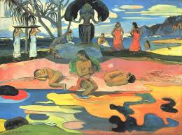
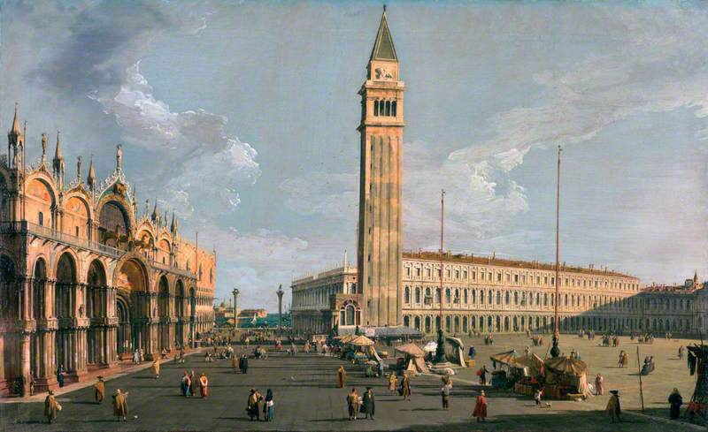

# Avatars, Monsters, and Machines: A Cyborg Archaeology
  
  "The overt implication of this is that we are making fanciful, unreal representations of past things, people, and places when producing archaeological interpretations." 
  
  This quote made me think of the *MESSY ASSEMBLAGES, RESIDUALITY AND RECURSION WITHIN A PHYGITAL NEXUS* reading where they wrote "In other words more detail is being lost with each new recursive rendering, print or scan." Though this is not quite the same thing I believe that the lose of detail can result in a new object, thus producing "unreal representations of past things". This is also something that I discussed in another class (though were using real buidings as our examples instead of 3D models) where we looked at the Stylistic Movement happening in the 1800s. The issue with this movement was that there were features added to deteriorating buildings that were not original to the bulding, based on the fact that there was no archaeological evidence to prove it. So architects decided to place things that went with the visual style of the building even if it was not how the building looked, creating an example of unreal places and interfering with out understanding of history.
  
  This text also made me consider the large number of misconceptions people have about many historic (and even modern day) cultures because of the issues with romanticizing ideas for mass consumption. There is one painting in particular that reminds me of this (and if/when I find it I will add it below). The painting is a colourful representation of how western culture viewed people from other lands. As you can see they did not add clothes to some of the women, and there is a lack of buildngs in the background, creating an image of uncivilized people, and even making it seem like a vacation spot for the viewers who would have been from the UK for the most part.  
  
  
  
  In contrast with a painting of the western world
  
  
  
  
